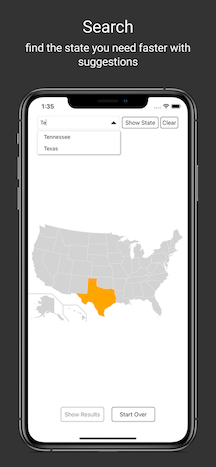

# Mapping US
> A no-nonsense app for writing in U.S. states on a map

[![Swift Version][swift-image]][swift-url]

Mapping US is an app for practicing your knowledge of States in America. 

## Built with

- iOS 14.0
- Xcode 12.0

[Privacy Policy](privacyPolicy.html)

[swift-image]:https://img.shields.io/badge/swift-5.0-orange.svg
[swift-url]: https://swift.org/